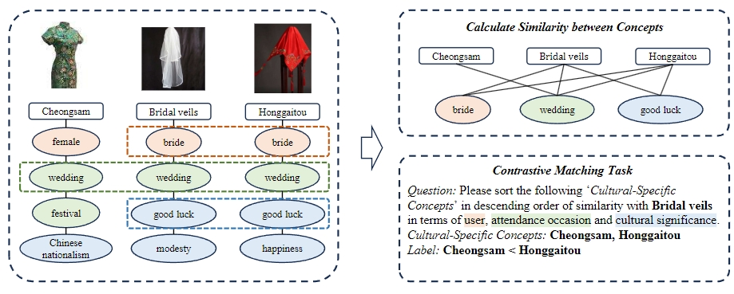

# CUNIT: How Well Do LLMs Identify Cultural Unity in Diversity?

[**Introduction**](#introduction) | [**Task**](#task) | [**Usage**](#run-the-evaluation) | [**Paper**](#paper_link)

This repository contains information about CUNIT, with the code and the data for this benchmark.

## Introduction

The Cultural Unity in Diversity (CUNIT) is the benchmark for evaluating decoder-only LLMs in understanding the cultural unity of concepts. It consists of 1,425 evaluation examples building upon tradtional cultural-specific concepts across 10 countries. We selected 3 strong large language models, and used 3 popular prompting strategies. Our analysis shows that LLMs are still limited to capturing cross-cultural associations between concepts compared to humans.

## Task

We designed a contrastive matching task to evaluate the LLMs, we select 3 different cultural concepts. For example, Given the query concept "Bridal veil" and two target candidates "Cheongsam" and "Honggaitou", our goal is to ask an LLM to identify the target concept that has a higher cultural-centered similarity with the query concept. In this case, the term "Honggaitou" should be selected.

## About the dataset

Our dataset includes 10 countries across 5 continents that have a large number of cross-cultural concepts in the category of clothing and food. All the data comes from the wikipedia.

## Download the data

The data used for testing has been placed in the currently directory, consists of different concepts and cultural concept triples.

## Modify the prompt

The prompt file is stored in the ./code/prompt.py. Our experiment includes different prompt strategies such as InputOutput, Oneshot, CoT, etc. You can replace different prompt methods for evaluation.

## Install the dependencies

There are very few dependencies in this project, and you can install all of them using the following command.

    pip install -r requirements.txt

## Run the evaluation

In this project, different functions and simple examples have been completed in "code" dictonary. And we implemented a simple shell to run the entire project.

    sh ./script/run.sh

